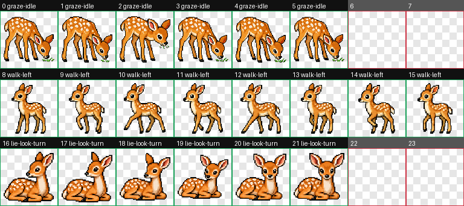

# Pixel Sprite Frames

通用像素 sprite / 像素动画 spritesheet 生成技能。

这个 skill 借用了 codex 的 `hatch-pet` 的工程化思路 （感谢openai）
它主要用于生成普通游戏、美术原型、Pixelorama/Godot/Unity 等场景可用的像素动画素材。
还在优化中，欢迎使用，欢迎提建议

## 说明

这是给 Codex 使用的 skill。agent 的实际执行规则、参数询问、帧数拆分建议、chroma-key 透明流程、layout guide 使用方式和脚本调用顺序，都以 `SKILL.md` 为准

## 安装

- 方法1: clone这个项目，将文件夹`pixel-sprite-frames` 拷贝到 `.codex\skills` 目录下
- 方法2: 直接发github链接发给codex，让他帮你安装这个skill

安装完成之后咨询你的agent怎么使用这个skill

## 环境与依赖

- Python 3.10+
- Pillow

Pillow 用于本地确定性后处理，例如 chroma-key 抠透明、裁帧、居中、组装 spritesheet、生成 contact sheet 和验证 alpha/cell

## 主要文件

- `SKILL.md`：skill 的主执行说明
- `assets/fawn-contact-sheet.png`：README 展示用的小鹿动画效果图
- `assets/fawn-spritesheet.png`：小鹿动画 spritesheet 示例
- `scripts/requirements.txt`：Python 依赖
- `scripts/prepare_sprite_run.py`：准备 run、prompt、job manifest 和 layout guide
- `scripts/record_sprite_result.py`：记录选中的 `$imagegen` 输出
- `scripts/finalize_sprite_run.py`：执行裁帧、组装、验证和 contact sheet 生成
